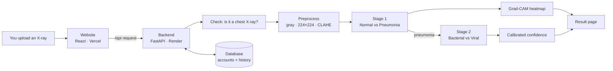

# PneumoScan AI

**An explainable AI system that looks at a chest X-ray and says whether it shows pneumonia — and,
if it does, whether the pattern looks bacterial or viral — while showing _where_ in the lungs it
looked to decide.**

> ⚠️ **Decision support only — not a diagnosis.** This is a student / research project. It must
> never replace a doctor, a radiologist, or laboratory tests, and it is not an approved medical device.

Runs on **Windows, macOS and Linux**. Can be hosted online **for free**: the website on Vercel and the AI
backend on Render ([Chapter 20](docs/guide/20-hosting-and-rehosting.md)).

---

## This README is a complete course

It is written for **everyone, including people who have never written code or opened a terminal.**
If you follow the guide in order, you will be able to:

1. **Install and run** the whole application on your computer (about 30 minutes, no coding).
2. **Learn the foundations from zero**: HTML and CSS, JavaScript and TypeScript, React, Python, FastAPI,
   how the web works, databases and security.
3. **Understand the AI from first principles**:
   - neural networks, CNNs and transformers;
   - DenseNet121 and the Swin Transformer, layer by layer;
   - calibration and Grad-CAM explanations.
4. **Download the data yourself** from the original public sources (one command), or collect your own.
5. **Train the models from scratch**, step by step, on a free Google Colab GPU or your own computer.
6. **Rebuild the entire project** from an empty folder, phase by phase.
7. **Package it with Docker** and **host it on the internet for free** under your own accounts.
8. **Improve it**, and prove that your change really is an improvement.

Every technical word is explained the first time it appears, and again in the
[Glossary](docs/guide/24-glossary.md).

---

## The 60-second explanation

1. You open the website and **upload a chest X-ray**.
2. The website sends it to the **backend**, a program running on a server.
3. The backend checks that it really is a chest X-ray. It then shrinks it to 224 × 224 pixels and
   improves its contrast.
4. Two **neural networks** look at it. These are programs that learned from thousands of labelled X-rays.
   - **Stage 1:** _Normal_ or _Pneumonia?_
   - **Stage 2** (only if pneumonia): _Bacterial_ or _Viral?_
5. **Grad-CAM** colours the parts of the image that influenced the decision (red = most influence).
6. The website shows:
   - the answer and a **calibrated** confidence;
   - the heatmap;
   - a warning when the model is unsure ("recommend expert review").

   Each user has an account with a private history.



---

## Quick start: run it on your computer

> Never used a terminal? Start with [Chapter 1, Computer basics](docs/guide/01-computer-basics.md).
> The click-by-click version of this section is [Chapter 2](docs/guide/02-install-and-run.md).

Install **Git**, **Python 3.10+** and **Node.js 20+**. Then run these commands in a terminal:

```bash
# 1. Download the project
git clone https://github.com/UzumakiAnirudh/Pneumonia-Check.git
cd Pneumonia-Check

# 2. Start the backend (the AI server) — leave this terminal open
cd backend
python3 -m venv .venv                     # Windows: python -m venv .venv
source .venv/bin/activate                 # Windows: .venv\Scripts\activate
pip install -r requirements-deploy.txt
python -m uvicorn app.main:app --port 8000
```

Open a **second** terminal:

```bash
# 3. Start the website
cd Pneumonia-Check/frontend
npm install
npm run dev
```

Open **http://localhost:5173**, then:

1. Click **Register**.
2. Open **Analyze**.
3. Click a sample X-ray.
4. Click **Analyze**. 🎉

`requirements-deploy.txt` is the lightweight install (about 400 MB, no PyTorch). It runs the trained models
that are already included in `backend/weights/` as ONNX files. Training needs the full install
([Chapter 15](docs/guide/15-train-from-scratch-step-by-step.md)).

**Prefer Docker?** Run `docker compose up --build`, then open http://localhost:8080
([Chapter 19](docs/guide/19-docker.md)).

---

## The complete guide (24 chapters)

### Part I: Get started

| #   | Chapter                                                     | You will learn                                                                                                   |
| --- | ----------------------------------------------------------- | ---------------------------------------------------------------------------------------------------------------- |
| 1   | [Computer basics](docs/guide/01-computer-basics.md)         | Files, folders and the terminal; installing Git, Python, Node.js and VS Code on Windows, macOS and Linux; GitHub |
| 2   | [Install and run](docs/guide/02-install-and-run.md)         | Running the app step by step, a tour of every page, stopping it, common errors                                   |
| 3   | [How the whole system works](docs/guide/03-how-it-works.md) | The journey of one X-ray through the code; every folder explained                                                |

### Part II: Programming foundations (from zero)

| #   | Chapter                                                                               | You will learn                                                                                                          |
| --- | ------------------------------------------------------------------------------------- | ----------------------------------------------------------------------------------------------------------------------- |
| 4   | [HTML and CSS](docs/guide/04-html-css-basics.md)                                      | Your first web page, tags, forms and accessibility; CSS selectors, the box model, Flexbox, Grid, dark mode and Tailwind |
| 5   | [JavaScript and TypeScript](docs/guide/05-javascript-typescript-basics.md)            | Variables, functions, arrays and objects; the DOM, events, async/fetch and modules; npm and TypeScript types            |
| 6   | [React](docs/guide/06-react-basics.md)                                                | Components, props, state, effects, hooks and routing; you also build a mini X-ray analyzer                              |
| 7   | [Python](docs/guide/07-python-basics.md)                                              | Everything from `print` to classes; files and virtual environments; NumPy, OpenCV and pandas; command-line tools        |
| 8   | [FastAPI](docs/guide/08-fastapi-basics.md)                                            | Building an image API step by step: endpoints, validation, uploads, dependencies, cookies, settings and tests           |
| 9   | [The web, APIs, databases and security](docs/guide/09-web-apis-databases-security.md) | URLs, DNS, HTTPS and HTTP in detail; REST, CORS and cookies; hands-on SQL and SQLModel; security threats and defences   |

### Part III: The AI

| #   | Chapter                                                                              | You will learn                                                                                                            |
| --- | ------------------------------------------------------------------------------------ | ------------------------------------------------------------------------------------------------------------------------- |
| 10  | [Deep learning from zero](docs/guide/10-deep-learning-fundamentals.md)               | Images as numbers, neurons, training, loss and gradients; CNNs and transfer learning; every metric and calibration        |
| 11  | [DenseNet121 and Swin Transformer: mastery](docs/guide/11-densenet-and-swin.md)      | Both architectures layer by layer, with shapes, maths, parameter counts and design reasons                                |
| 12  | [Explainability: Grad-CAM](docs/guide/12-explainability-gradcam.md)                  | How heatmaps are computed (with the maths), the lung-attention check, and its limits                                      |
| 13  | [The data](docs/guide/13-data.md)                                                    | Every dataset, its source and licence; downloading, labels and patient-grouped splits; collecting your own data ethically |
| 14  | [Training pipeline (reference)](docs/guide/14-training-pipeline.md)                  | Each training script, its options and its outputs                                                                         |
| 15  | [Train from scratch, step by step](docs/guide/15-train-from-scratch-step-by-step.md) | Every click and command on Google Colab or your own computer, with real expected outputs and timings                      |

### Part IV: The code, rebuilding and shipping

| #   | Chapter                                                                  | You will learn                                                                                                                        |
| --- | ------------------------------------------------------------------------ | ------------------------------------------------------------------------------------------------------------------------------------- |
| 16  | [Backend code walkthrough](docs/guide/16-backend-walkthrough.md)         | Every Python file in `backend/`                                                                                                       |
| 17  | [Frontend code walkthrough](docs/guide/17-frontend-walkthrough.md)       | Every page and component in `frontend/`                                                                                               |
| 18  | [Rebuild everything from scratch](docs/guide/18-rebuild-from-scratch.md) | A 10-phase recipe from an empty folder, with checkpoints                                                                              |
| 19  | [Docker](docs/guide/19-docker.md)                                        | Containers from zero; this project's Dockerfiles, nginx and Compose, line by line                                                     |
| 20  | [Hosting and re-hosting (free)](docs/guide/20-hosting-and-rehosting.md)  | Click by click: your own GitHub, the Render backend, the Vercel website and an optional Neon database; updates, rollbacks and domains |
| 21  | [Testing and code quality](docs/guide/21-testing-and-quality.md)         | The automated tests (57 backend + 22 frontend), linting, writing your own tests                                                       |

### Part V: Results and reference

| #   | Chapter                                                                   | You will learn                                                                              |
| --- | ------------------------------------------------------------------------- | ------------------------------------------------------------------------------------------- |
| 22  | [Results, lessons and improvements](docs/guide/22-results-and-lessons.md) | Real numbers for children and adults, a rejected experiment, two real bugs, what to improve |
| 23  | [Troubleshooting and FAQ](docs/guide/23-troubleshooting-faq.md)           | Fixes for the problems people actually hit                                                  |
| 24  | [Glossary](docs/guide/24-glossary.md)                                     | 150+ technical terms in plain English                                                       |

### Suggested learning paths

| Goal                               | Chapters                                |
| ---------------------------------- | --------------------------------------- |
| Just run it                        | 1 → 2                                   |
| Understand it without coding       | 1 → 3 → 10 → 11 → 12 → 22               |
| Learn to program with this project | 1 → 2 → 4 → 5 → 6 → 7 → 8 → 9 → 16 → 17 |
| Machine learning                   | 10 → 11 → 12 → 13 → 15 → 22             |
| Recreate and host everything       | 1 → 2 → 3 → 13 → 15 → 18 → 19 → 20      |

---

## Re-hosting in five steps (summary of Chapter 20)

1. **Copy the code to your own GitHub account:** fork the repository, or push your copy to a new one.
2. **Use your own names:** edit the service name in `render.yaml` and the backend address in `vercel.json`.
   Then commit and push.
3. **Deploy the backend on Render:** **New +** → **Blueprint** → choose your repository → **Apply**.
   - Wait until it shows **Live**.
   - Check that `https://<your-api>.onrender.com/api/health` shows `"status":"ok"`.
4. **Deploy the website on Vercel:** **Add New** → **Project** → import the repository → **Deploy**.
   - Check that `https://<your-site>.vercel.app/api/health` shows the same response.
5. _(Optional)_ **Keep accounts permanently:** create a free Neon Postgres database. Paste its URL into
   Render's `DATABASE_URL` setting.

After that, every `git push` redeploys both automatically.

---

## Project at a glance

| Part               | Folder                               | Technology                                                                   |
| ------------------ | ------------------------------------ | ---------------------------------------------------------------------------- |
| Website (frontend) | [`frontend/`](frontend/)             | React 18, TypeScript, Vite, Tailwind CSS, TanStack Query, Zustand, Recharts  |
| Server (backend)   | [`backend/`](backend/)               | Python, FastAPI, SQLModel (SQLite/Postgres), OpenCV, ONNX Runtime or PyTorch |
| AI training        | [`training/`](training/)             | PyTorch, timm, scikit-learn, pytorch-grad-cam, Google Colab notebooks        |
| Containers         | `docker-compose.yml`, `*/Dockerfile` | Docker, nginx                                                                |
| Hosting            | `vercel.json`, `render.yaml`         | Vercel (website) + Render (backend), both free                               |
| This course        | [`docs/guide/`](docs/guide/)         | 24 chapters                                                                  |

**Results on 879 held-out pediatric test X-rays** (images the models never saw while learning):

| Task                                 | DenseNet121   | Swin Transformer |
| ------------------------------------ | ------------- | ---------------- |
| Normal vs Pneumonia — accuracy / AUC | 97.4% / 0.996 | 97.7% / 0.999    |
| Bacterial vs Viral — accuracy / AUC  | 77.0% / 0.838 | 77.5% / 0.850    |
| Full 3-class result — accuracy       | 80.9%         | 82.0%            |

On **adults** and on X-rays from **other hospitals**, performance is lower. Read
[Chapter 22](docs/guide/22-results-and-lessons.md) before trusting any number.

---

## Reference

### API

| Method       | Path                                                          | Login? | What it does                                                                                                                |
| ------------ | ------------------------------------------------------------- | ------ | --------------------------------------------------------------------------------------------------------------------------- |
| GET          | `/api/health`                                                 | no     | Server, model, calibration and training status                                                                              |
| POST         | `/api/auth/register` · `/api/auth/login` · `/api/auth/logout` | –      | Accounts (httpOnly session cookie)                                                                                          |
| GET          | `/api/auth/me`                                                | yes    | The logged-in user                                                                                                          |
| POST         | `/api/validate`                                               | yes    | Is this image a usable chest X-ray?                                                                                         |
| POST         | `/api/predict`                                                | yes    | Takes `file`, `model` (`densenet`/`swin`/`both`), `threshold` and `save_history`; returns predictions and Grad-CAM heatmaps |
| GET / DELETE | `/api/history`, `/api/history/{id}`                           | yes    | Your own analyses only                                                                                                      |
| GET          | `/api/metrics`, `/api/samples`                                | no     | Dashboard data, example X-rays                                                                                              |

For interactive API docs, run the backend and open **http://localhost:8000/docs**.

### Configuration (`backend/.env`)

To change settings, copy `backend/.env.example` to `backend/.env`.

| Setting               | Default     | Meaning                                                                                                                              |
| --------------------- | ----------- | ------------------------------------------------------------------------------------------------------------------------------------ |
| `MODEL_BACKEND`       | `auto`      | `torch` (PyTorch `.pth` files) or `onnx` (lightweight `.onnx` files). `auto` uses PyTorch if it is installed and `.pth` files exist. |
| `CLASSIFICATION_MODE` | `two_stage` | or `three_class` (one model for Normal/Bacterial/Viral)                                                                              |
| `DEFAULT_THRESHOLD`   | `0.75`      | Below this confidence, a result says "recommend expert review"                                                                       |
| `HISTORY_ENABLED`     | `true`      | Store analysis history (thumbnail + results) per account                                                                             |
| `DATABASE_URL`        | SQLite file | Use a Postgres URL to keep accounts permanently in the cloud                                                                         |
| `COOKIE_SECURE`       | `false`     | Set to `true` when the site is served over HTTPS                                                                                     |
| `USE_MOCK_MODELS`     | `false`     | Simulated outputs, for UI development and automated tests only                                                                       |

### Common commands

| Task                                | Command                                                                                                   |
| ----------------------------------- | --------------------------------------------------------------------------------------------------------- |
| Run the backend                     | `cd backend && source .venv/bin/activate && python -m uvicorn app.main:app --port 8000`                   |
| Run the website                     | `cd frontend && npm run dev`                                                                              |
| Download the data                   | `cd training && python download_data.py kermany`                                                          |
| Train everything (Version 1 recipe) | `cd training && SPLITS=data/splits.csv bash run_pipeline.sh --epochs 10 --patience 4 --warmup-epochs 0.5` |
| Run the tests                       | `cd backend && pytest` · `cd frontend && npm test`                                                        |
| Run with Docker                     | `docker compose up --build`                                                                               |

## Privacy and ethics

- Uploaded images are processed **in memory**. Image metadata (EXIF, DICOM patient tags) is removed.
- History stores only a 192-pixel thumbnail, a small heatmap, the results and a timestamp. It is kept
  only for the logged-in account, and it can be switched off or deleted at any time.
- Passwords are never stored, only a salted PBKDF2 hash. Sessions use httpOnly, SameSite cookies.
- **Testing with real patient X-rays requires informed consent and approval from an ethics committee.**
- Datasets are used under their licences (Kermany is CC BY 4.0; the others are listed in
  [Chapter 13](docs/guide/13-data.md)).

## Credits

- Kermany D., Zhang K., Goldbaum M. (2018), _Labeled Optical Coherence Tomography (OCT) and Chest X-Ray
  Images for Classification_, Mendeley Data v2, doi:10.17632/rscbjbr9sj.2
- Cohen J.P. et al., _COVID-19 Image Data Collection_
- Chung A., _Figure1_ and _Actualmed_ COVID-19 chest X-ray datasets
- Jaeger S. et al., _Two public chest X-ray datasets for computer-aided screening of pulmonary diseases_
  (Shenzhen, US National Library of Medicine)
- Huang G. et al., _Densely Connected Convolutional Networks_ (2017)
- Liu Z. et al., _Swin Transformer_ (2021)
- Selvaraju R.R. et al., _Grad-CAM_ (2017)
- Guo C. et al., _On Calibration of Modern Neural Networks_ (2017)
