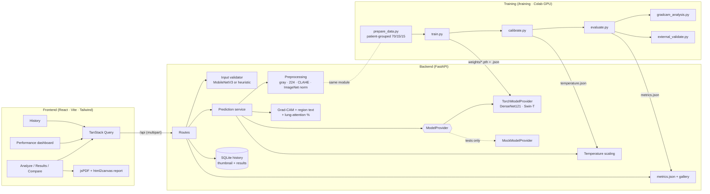

# PneumoScan AI

**Explainable deep learning for pneumonia detection on chest X-rays.**
Two-stage classification (Normal vs Pneumonia → Bacterial vs Viral) with DenseNet121 and a Swin
Transformer, calibrated confidences, Grad-CAM explanations, and a model-performance dashboard.

> ⚠️ **Decision support only — not a diagnosis.** PneumoScan AI is intended to assist healthcare
> professionals. It does not replace clinical judgement, radiologist review or laboratory testing,
> and it is not a validated medical device.

---

## Contents

| Folder | What |
|---|---|
| [`frontend/`](frontend/) | React 18 + TypeScript + Vite + Tailwind web app |
| [`backend/`](backend/) | FastAPI service: validation, preprocessing, models, calibration, Grad-CAM, history |
| [`training/`](training/) | Data preparation, training, calibration, evaluation, external validation, Grad-CAM analysis, Colab notebooks |

## Architecture



**Inference flow:** upload → validate (is it a frontal CXR? resolution/quality) → preprocess →
Stage 1 → (if pneumonia) Stage 2 → temperature-scaled probabilities → Grad-CAM on the Stage 1
prediction → plain-language region summary + share of attention inside the lung fields →
reliability flag (any stage below the threshold ⇒ "recommend expert review").

## Quick start (local development)

Requirements: **Node 20+**, **Python 3.10+**.

### 1. Backend — http://localhost:8000 (docs at `/docs`)

```bash
cd backend
python -m venv .venv && source .venv/bin/activate      # Windows: .venv\Scripts\activate
pip install -r requirements-dev.txt                    # CPU torch: add --extra-index-url https://download.pytorch.org/whl/cpu
cp .env.example .env                                    # uses the trained weights in backend/weights
python -m uvicorn app.main:app --reload --port 8000
```

### 2. Frontend — http://localhost:5173

```bash
cd frontend
npm install
npm run dev            # proxies /api to http://localhost:8000 (VITE_PROXY_TARGET to change)
```

Open the app, go to **Analyze**, click a sample X-ray (or upload your own) and press **Analyze**.

### Docker (both services, one command) — http://localhost:8080

```bash
docker compose up --build
```

## Running the demo

1. **Home** → *Start Analysis*.
2. **Analyze**: choose *DenseNet121*, *Swin Transformer* or *Compare Both*; pick a sample (Normal / Bacterial / Viral).
3. Watch validation and the scan animation; the **Results** page shows Stage 1/Stage 2 labels, calibrated
   confidence, reliability badge, probability breakdown, and the Grad-CAM viewer (Original · Overlay ·
   Heatmap · Side-by-side, opacity slider, zoom/pan with mouse wheel/drag or `+`/`-`/arrows/`0`).
4. **Compare Models** re-runs both networks and shows an agreement indicator.
5. **Download Report (PDF)**, then **History** to reopen past analyses.
6. **Model Performance**: internal vs external metrics, confusion matrices, ROC/calibration curves,
   training curves and the Grad-CAM gallery. Try uploading a colour photo to see the input validator reject it.

> The bundled sample X-rays are real images from the **held-out test split** of the Kermany dataset
> (CC BY 4.0, exported by `training/export_samples.py`); the models never saw them during training.
> The dashboard shows the real evaluation results written by `training/evaluate.py`.

## Training the models

See [`training/README.md`](training/README.md). In short (GPU recommended — use `training/notebooks/*.ipynb` on Colab/Kaggle):

```bash
cd training && pip install -r requirements.txt
python prepare_data.py --data-root /path/to/chest_xray       # Kermany dataset, patient-grouped 70/15/15
for a in densenet swin; do for t in stage1 stage2; do python train.py --arch $a --task $t; done; done
python calibrate.py --all
python evaluate.py
python gradcam_analysis.py --arch densenet && python gradcam_analysis.py --arch swin
python external_validate.py --name "RSNA Pneumonia Detection" --rsna-labels ... --rsna-images ...
python train_validator.py --data data/validator              # optional: learned CXR validator
```

## Model weights

The API loads trained files from `backend/weights/` (details in [`backend/weights/README.md`](backend/weights/README.md)):
`densenet_stage1.pth`, `densenet_stage2.pth`, `swin_stage1.pth`, `swin_stage2.pth` (+ their `.json`
sidecars), `temperature.json`, and optionally `validator.pth`. **Settings → API status** shows which weights
loaded. (`USE_MOCK_MODELS=true` exists only for UI development and the automated tests.)

For the single 3-class approach, train with `--task three_class` and set `CLASSIFICATION_MODE=three_class`.

## Configuration (backend `.env`)

| Variable | Default | Meaning |
|---|---|---|
| `USE_MOCK_MODELS` | `false` | `true` = simulated outputs (development/tests only) |
| `CLASSIFICATION_MODE` | `two_stage` | or `three_class` |
| `DEFAULT_THRESHOLD` | `0.75` | Reliability threshold (UI setting overrides per request) |
| `HISTORY_ENABLED` | `true` | Server-side switch for history storage |
| `USE_CLAHE`, `IMAGE_SIZE` | `true`, `224` | Defaults; a model's `.json` sidecar from training takes precedence |
| `MIN_RESOLUTION`, `WARN_RESOLUTION` | `128`, `512` | Reject / warn thresholds (px, short side) |
| `DEVICE` | `auto` | `cpu`, `cuda`, `mps` |

## API

| Method | Path | Description |
|---|---|---|
| GET | `/api/health` | Backend, model, validator and calibration status |
| POST | `/api/validate` | `file` → is it a usable chest X-ray? |
| POST | `/api/predict` | `file`, `model` (`densenet`\|`swin`\|`both`), `threshold`, `save_history` → predictions, calibrated confidences, Grad-CAM PNGs (data URIs), timing |
| GET | `/api/metrics` | Evaluation metrics for the dashboard |
| GET | `/api/samples` | Bundled sample images |
| GET / DELETE | `/api/history`, `/api/history/{id}` | List, reopen, delete one, delete all |

Errors use `{"detail": {"code", "message", ...}}`; a rejected image returns `422 not_chest_xray` with the validation result.

## Privacy & ethics

- Uploads are processed **in memory**; nothing is written to disk unless history is enabled.
- Metadata is discarded: only decoded pixels are kept (EXIF dropped; DICOM patient/institution tags removed).
- History stores only a 192 px thumbnail, a thumbnail-size heatmap, the results and a timestamp. It can be
  disabled in Settings (per browser) or with `HISTORY_ENABLED=false` (server-wide), and cleared with *Delete all*.
- **Testing with real patient X-rays must only be done with informed consent and appropriate institutional /
  ethics approval.**

### Known limitations
Trained on pediatric images from a single centre; viral/bacterial distinction from radiographs alone is
unreliable; Grad-CAM is coarse and correlational; calibration may not transfer to new sites.

## Development

```bash
# backend
cd backend && pytest && black --check app tests scripts
# frontend
cd frontend && npm run lint && npm run typecheck && npm test && npm run build
```

Refresh the sample images from the test split: `python training/export_samples.py`.
