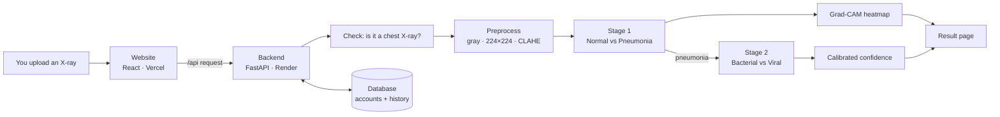

# PneumoScan AI

**An explainable AI system that looks at a chest X-ray and says whether it shows pneumonia — and,
if it does, whether the pattern looks bacterial or viral — while showing _where_ in the lungs it
looked to decide.**

> ⚠️ **Decision support only — not a diagnosis.** This is a student / research project. It must
> never replace a doctor, a radiologist, or laboratory tests, and it is not an approved medical device.

Live demo (if deployed): website on **Vercel**, AI backend on **Render** — see
[Chapter 13](docs/guide/13-deployment.md).

---

## Who this README is for

**Everyone — including people who have never written code or opened a terminal.**

This repository is written to be a complete course. If you follow the guide in order, you will be able to:

1. **Install and run** the whole application on your own computer (about 30 minutes, no coding).
2. **Understand every part** — the website, the server, the database, the login system, the data,
   and the two neural networks (DenseNet121 and the Swin Transformer) — from first principles.
3. **Collect the data yourself**, from the original public sources, and **retrain the models**.
4. **Rebuild the entire project from an empty folder** and get the same results.
5. **Improve it** — and know how to prove that your change really is an improvement.

Every technical word is explained the first time it appears, and again in the
[Glossary](docs/guide/17-glossary.md).

---

## The 60-second explanation

1. You open the website and **upload a chest X-ray** (a photo of the inside of the chest).
2. The website sends it to the **backend** — a program running on a server.
3. The backend checks it really is a chest X-ray, then shrinks it to 224 × 224 pixels and improves
   its contrast.
4. Two **neural networks** — programs that learned from thousands of labelled X-rays — look at it:
   - **Stage 1:** _Normal_ or _Pneumonia?_
   - **Stage 2** (only if pneumonia): _Bacterial_ or _Viral?_
5. **Grad-CAM** colours the parts of the image that influenced the decision (red = most influence).
6. The website shows the answer, how confident the model is, the heatmap, and a warning when the
   model is unsure ("recommend expert review").



---

## Quick start — run it on your computer

> Never used a terminal? Read [Chapter 1 — Computer basics](docs/guide/01-computer-basics.md)
> first; it walks you through installing everything below with screenshots-in-words.
> The full, click-by-click version of this section is [Chapter 2](docs/guide/02-install-and-run.md).

You need **Git**, **Python 3.10+** and **Node.js 20+**. Then, in a terminal:

```bash
# 1. Download the project
git clone https://github.com/UzumakiAnirudh/Pneumonia-Check.git
cd Pneumonia-Check

# 2. Start the backend (the AI server)  — leave this terminal open
cd backend
python3 -m venv .venv
source .venv/bin/activate            # Windows: .venv\Scripts\activate
pip install -r requirements-deploy.txt
python -m uvicorn app.main:app --port 8000
```

Open a **second** terminal:

```bash
# 3. Start the website
cd Pneumonia-Check/frontend
npm install
npm run dev
```

Now open **http://localhost:5173** in your browser → **Register** → **Analyze** → click a sample
X-ray → **Analyze**. 🎉

`requirements-deploy.txt` installs the lightweight version (no PyTorch, ~400 MB) that runs the
models already included in `backend/weights/`. To **train** models you need the full version — see
[Chapter 9](docs/guide/09-training-pipeline.md).

---

## The complete guide (read in order)

| #   | Chapter                                                                          | You will learn                                                                                       |
| --- | -------------------------------------------------------------------------------- | ---------------------------------------------------------------------------------------------------- |
| 1   | [Computer basics](docs/guide/01-computer-basics.md)                              | Files, folders, the terminal, installing Git / Python / Node.js / VS Code, GitHub                    |
| 2   | [Install and run](docs/guide/02-install-and-run.md)                              | Running the app step by step, using every page, stopping it, common errors                           |
| 3   | [How the whole system works](docs/guide/03-how-it-works.md)                      | The journey of one X-ray through the system; every folder explained                                  |
| 4   | [Programming basics](docs/guide/04-programming-basics.md)                        | Python, JavaScript/TypeScript, HTML/CSS, React, HTTP & APIs, JSON, databases, passwords & logins     |
| 5   | [Deep learning from zero](docs/guide/05-deep-learning-fundamentals.md)           | Images as numbers, neurons, training, loss, gradients, CNNs, transfer learning, metrics, calibration |
| 6   | [DenseNet121 and Swin Transformer — mastery](docs/guide/06-densenet-and-swin.md) | Both architectures layer by layer, with shapes, math, parameter counts and design reasons            |
| 7   | [Explainability: Grad-CAM](docs/guide/07-explainability-gradcam.md)              | How heatmaps are computed (with the math), the lung-attention check, limits                          |
| 8   | [The data](docs/guide/08-data.md)                                                | Every dataset, where it comes from, how to download it or collect your own, labels, splits, ethics   |
| 9   | [Training pipeline](docs/guide/09-training-pipeline.md)                          | Each training script, the exact commands, what the output means, Google Colab                        |
| 10  | [Backend code walkthrough](docs/guide/10-backend-walkthrough.md)                 | Every Python file in `backend/` and what it does                                                     |
| 11  | [Frontend code walkthrough](docs/guide/11-frontend-walkthrough.md)               | Every React page and component in `frontend/`                                                        |
| 12  | [Rebuild everything from scratch](docs/guide/12-rebuild-from-scratch.md)         | An ordered recipe to recreate the whole project in an empty folder                                   |
| 13  | [Deployment (free)](docs/guide/13-deployment.md)                                 | GitHub, Vercel, Render, ONNX, quantization — putting it on the internet for free                     |
| 14  | [Testing and code quality](docs/guide/14-testing-and-quality.md)                 | Automated tests, linting, formatting, how to check your changes                                      |
| 15  | [Results, lessons and improvements](docs/guide/15-results-and-lessons.md)        | Our real numbers, a failed experiment and why it matters, what to improve next                       |
| 16  | [Troubleshooting & FAQ](docs/guide/16-troubleshooting-faq.md)                    | Fixes for the problems people actually hit                                                           |
| 17  | [Glossary](docs/guide/17-glossary.md)                                            | Every technical term in one place                                                                    |

---

## Project at a glance

| Part               | Folder                       | Technology                                                                   |
| ------------------ | ---------------------------- | ---------------------------------------------------------------------------- |
| Website (frontend) | [`frontend/`](frontend/)     | React 18, TypeScript, Vite, Tailwind CSS, TanStack Query, Zustand, Recharts  |
| Server (backend)   | [`backend/`](backend/)       | Python, FastAPI, SQLModel (SQLite/Postgres), OpenCV, PyTorch or ONNX Runtime |
| AI training        | [`training/`](training/)     | PyTorch, timm, scikit-learn, pytorch-grad-cam, Jupyter/Colab notebooks       |
| Deployment         | `vercel.json`, `render.yaml` | Vercel (website) + Render (backend), both free                               |

**Results on 879 held-out pediatric test X-rays** (images the models never saw while learning):

| Task                                 | DenseNet121   | Swin Transformer |
| ------------------------------------ | ------------- | ---------------- |
| Normal vs Pneumonia — accuracy / AUC | 97.4% / 0.996 | 97.7% / 0.999    |
| Bacterial vs Viral — accuracy / AUC  | 77.0% / 0.838 | 77.5% / 0.850    |
| Full 3-class result — accuracy       | 80.9%         | 82.0%            |

On **adults** and **other hospitals** performance is lower — read
[Chapter 15](docs/guide/15-results-and-lessons.md) before trusting any number.

---

## API reference (for developers)

| Method       | Path                                                          | Login? | What it does                                                                                     |
| ------------ | ------------------------------------------------------------- | ------ | ------------------------------------------------------------------------------------------------ |
| GET          | `/api/health`                                                 | no     | Server, model and training status                                                                |
| POST         | `/api/auth/register` · `/api/auth/login` · `/api/auth/logout` | –      | Accounts (httpOnly session cookie)                                                               |
| GET          | `/api/auth/me`                                                | yes    | The logged-in user                                                                               |
| POST         | `/api/validate`                                               | yes    | Is this image a usable chest X-ray?                                                              |
| POST         | `/api/predict`                                                | yes    | `file`, `model` (`densenet`/`swin`/`both`), `threshold`, `save_history` → predictions + Grad-CAM |
| GET / DELETE | `/api/history`, `/api/history/{id}`                           | yes    | Your own analyses only                                                                           |
| GET          | `/api/metrics`, `/api/samples`                                | no     | Dashboard data, example X-rays                                                                   |

Interactive API docs: run the backend and open **http://localhost:8000/docs**.

## Configuration (`backend/.env`)

Copy `backend/.env.example` to `backend/.env` to change settings. The important ones:

| Setting               | Default     | Meaning                                                                                                    |
| --------------------- | ----------- | ---------------------------------------------------------------------------------------------------------- |
| `MODEL_BACKEND`       | `auto`      | `torch` (PyTorch `.pth`), `onnx` (lightweight `.onnx`), or `auto` = PyTorch if installed and weights exist |
| `CLASSIFICATION_MODE` | `two_stage` | or `three_class` (one model for Normal/Bacterial/Viral)                                                    |
| `DEFAULT_THRESHOLD`   | `0.75`      | Below this confidence a result says "recommend expert review"                                              |
| `HISTORY_ENABLED`     | `true`      | Store analysis history (thumbnail + results) per account                                                   |
| `DATABASE_URL`        | SQLite file | Use a Postgres URL to keep accounts permanently in the cloud                                               |
| `COOKIE_SECURE`       | `false`     | Set `true` when served over HTTPS                                                                          |
| `USE_MOCK_MODELS`     | `false`     | Simulated outputs — for UI development and automated tests only                                            |

## Privacy and ethics

- Uploaded images are processed **in memory**; image metadata (EXIF, DICOM patient tags) is removed.
- History stores only a 192-pixel thumbnail, a small heatmap, the results and a timestamp — and only
  for the logged-in account. It can be switched off or deleted at any time.
- Passwords are never stored — only a salted PBKDF2 hash. Sessions use httpOnly, SameSite cookies.
- **Testing with real patient X-rays requires informed consent and approval from an ethics committee.**
- Datasets are used under their licences (Kermany CC BY 4.0; others as listed in
  [Chapter 8](docs/guide/08-data.md)).

## Credits

Kermany D., Zhang K., Goldbaum M. (2018), _Labeled Optical Coherence Tomography (OCT) and Chest X-Ray
Images for Classification_, Mendeley Data v2, doi:10.17632/rscbjbr9sj.2 · Cohen J.P. et al., _COVID-19
Image Data Collection_ · Chung A., _Figure1_ and _Actualmed_ COVID-19 chest X-ray datasets · Jaeger S.
et al., _Two public chest X-ray datasets for computer-aided screening of pulmonary diseases_ (Shenzhen,
US National Library of Medicine) · Huang G. et al., _Densely Connected Convolutional Networks_ (2017) ·
Liu Z. et al., _Swin Transformer_ (2021) · Selvaraju R.R. et al., _Grad-CAM_ (2017) · Guo C. et al.,
_On Calibration of Modern Neural Networks_ (2017).
