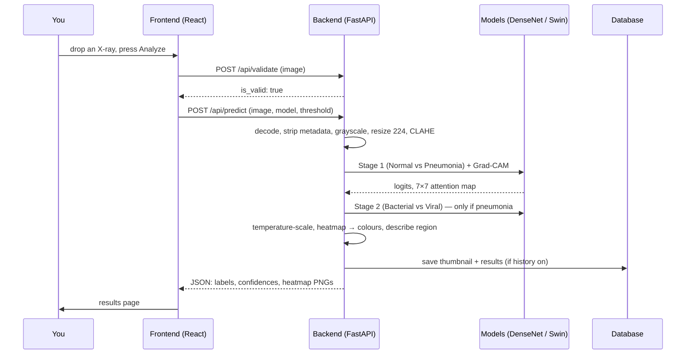
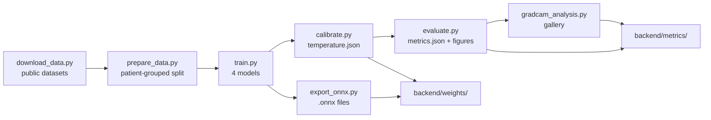

# Chapter 3 — How the whole system works

[← Chapter 2](02-install-and-run.md) · [README](../../README.md) · Next: [Chapter 4 →](04-html-css-basics.md)

This chapter follows **one X-ray** from your mouse click to the result on screen, naming the exact
file that does each step. Don't worry if some words are new — Chapters 4–12 explain each idea in depth.

---

## 3.1 The three parts

| Part                   | Lives in    | Runs where                                        | Job                                                                                          |
| ---------------------- | ----------- | ------------------------------------------------- | -------------------------------------------------------------------------------------------- |
| **Frontend** (website) | `frontend/` | In your **browser**                               | Pages, buttons, the image viewer, charts                                                     |
| **Backend** (server)   | `backend/`  | On a **server** (your computer, or Render online) | Checks images, runs the AI, stores accounts and history                                      |
| **Training**           | `training/` | On a computer with a good GPU (or Google Colab)   | Teaches the neural networks from labelled X-rays; produces the model files the backend loads |

The frontend and backend talk over **HTTP**, the same language your browser uses for every website.
The frontend sends a _request_ ("here is an image, analyse it"); the backend sends back a
_response_ in **JSON** (structured text — Chapter 9).

## 3.2 The journey of one X-ray



Step by step, with the code responsible:

1. **You choose an image.** `frontend/src/features/upload/UploadZone.tsx` accepts PNG, JPEG or
   DICOM (the medical image format) up to 25 MB. Sample images come from `GET /api/samples`.
2. **You press Analyze.** `frontend/src/features/analysis/useRunAnalysis.ts` drives the steps and the
   animated progress list.
3. **Validation.** The frontend sends the file to `POST /api/validate`
   (`backend/app/api/routes.py`). `backend/app/services/validator.py` checks it looks like a frontal
   chest X-ray: is it grayscale? sensible shape? a bright spine between two darker lungs? left–right
   symmetric? big enough? A colour photo or a document is rejected with a friendly message.
4. **Prediction request.** `POST /api/predict` with the image, the chosen model and your confidence
   threshold. Only logged-in users may call it; `backend/app/api/deps.py` checks the session cookie.
5. **Decoding and privacy.** `backend/app/services/preprocessing.py` → `load_image()` turns the file
   bytes into a grid of numbers and **throws away all metadata** (EXIF; DICOM patient name, ID,
   hospital...). Nothing is written to disk.
6. **Preprocessing** (same file): convert to grayscale → resize to **224 × 224** pixels → **CLAHE**
   (contrast enhancement) → copy into 3 channels → normalise with ImageNet mean/std. _Exactly_ the
   same code was used during training, so the model sees images the way it learned them.
7. **Stage 1 — Normal vs Pneumonia.** `backend/app/services/predictor.py` asks the **model
   provider** for a prediction plus a Grad-CAM map. Providers live in `backend/app/models/`:
   - `real_provider.py` — PyTorch, using `.pth` files (for development/training machines),
   - `onnx_provider.py` — ONNX Runtime, using `.onnx` files (lightweight; used online),
   - `mock_provider.py` — fake outputs, only for automated tests.
8. **Calibration.** Raw model scores ("logits") are divided by a learned **temperature** from
   `backend/weights/temperature.json` and turned into probabilities (`services/calibration.py`), so
   "90% confident" really means right about 90% of the time.
9. **Stage 2 — Bacterial vs Viral** runs only if Stage 1 said pneumonia.
10. **Explanation.** `services/gradcam.py` colours the 7×7 attention map (blue → red), blends it
    onto the X-ray, finds the hottest lung zone ("lower right lung"), and measures how much attention
    fell inside the lungs using the mask from `services/lung_mask.py`.
11. **Reliability.** If any stage's confidence is below your threshold (default 75%), the result is
    flagged **"Low confidence — recommend expert review"**.
12. **History.** If enabled, `services/history.py` saves a 192-pixel thumbnail, a small heatmap and
    the results, tagged with _your_ user ID.
13. **Response.** Everything is returned as JSON (shape defined in `backend/app/schemas/prediction.py`
    and mirrored in `frontend/src/api/types.ts`).
14. **Display.** `frontend/src/pages/ResultsPage.tsx` shows it using `ExplanationViewer.tsx`
    (image + heatmap layers, zoom/pan) and `ResultsPanel.tsx` (labels, bars, badges).

## 3.3 Where the trained models come from



Training produces files that the backend simply **loads**: model weights (`backend/weights/*.pth`
or `*.onnx`), each model's preprocessing settings (`*.json`), the temperatures, and the dashboard
data (`backend/metrics/metrics.json` + gallery images). Chapter 14 covers each script.

## 3.4 Every folder, explained

```
Pneumonia-Check/
├── README.md                 Front page of this guide
├── docs/guide/               This course (24 chapters)
├── vercel.json               How Vercel builds the website and forwards /api to the backend
├── render.yaml               How Render runs the backend for free
├── docker-compose.yml        Optional: run everything with Docker
│
├── frontend/                 THE WEBSITE (React + TypeScript)
│   ├── index.html            The single HTML page React draws into
│   ├── package.json          List of JavaScript libraries + scripts (npm run dev/build/test)
│   ├── vite.config.ts        Dev server, /api proxy, test setup
│   ├── tailwind.config.ts    Design system: colours, fonts, shadows
│   └── src/
│       ├── main.tsx          Entry point: starts React
│       ├── App.tsx           The list of pages (routes) and which need login
│       ├── api/              Talking to the backend: types, HTTP client, data hooks
│       ├── pages/            One file per page (Landing, Analyze, Results, History, ...)
│       ├── features/         Bigger building blocks grouped by feature (upload, analysis, auth, performance, report)
│       ├── components/       Small reusable pieces (buttons, cards, viewer, layout, logo)
│       ├── store/            Shared app state (settings, current analysis)
│       ├── styles/index.css  Colours for light/dark mode, base styles
│       ├── utils/            Helpers (formatting, labels/colours, theme, images)
│       └── __tests__/        Automated tests (Vitest)
│
├── backend/                  THE SERVER (Python + FastAPI)
│   ├── app/
│   │   ├── main.py           Builds the app: loads models, database, routes
│   │   ├── config.py         All settings (read from environment / .env)
│   │   ├── db.py             Database connection (SQLite or Postgres)
│   │   ├── api/              HTTP endpoints: routes.py, auth_routes.py, deps.py (login check)
│   │   ├── schemas/          The exact shape of every request/response
│   │   ├── models/           Neural-network loading: specs, architectures, PyTorch/ONNX/mock providers
│   │   └── services/         The real work: preprocessing, validator, predictor, Grad-CAM,
│   │                         lung mask, calibration, auth, history, evaluation metrics
│   ├── weights/              Trained models (.onnx; .pth locally), temperature.json
│   ├── metrics/              Dashboard data (metrics.json) and Grad-CAM gallery images
│   ├── samples/              The six example X-rays shown on the Analyze page
│   ├── tests/                Automated tests (pytest)
│   ├── requirements*.txt     Python libraries (deploy = light, full = with PyTorch, dev = + tests)
│   └── data/                 (created at runtime) history.db — accounts and history
│
└── training/                 TEACHING THE MODELS (Python + PyTorch)
    ├── download_data.py      Download every dataset from its source
    ├── prepare_data.py       Build the patient-grouped 70/15/15 split (children)
    ├── prepare_adult.py      Add adult datasets; build the unseen-hospital test
    ├── dataset.py            Load images + augmentation for training
    ├── train.py              Train one model (DenseNet or Swin, Stage 1/2/3-class)
    ├── calibrate.py          Learn temperature scaling
    ├── evaluate.py           Test-set metrics + figures
    ├── external_validate.py  Test on a dataset from another hospital
    ├── gradcam_analysis.py   Build the Grad-CAM gallery and attention statistics
    ├── export_onnx.py        Convert models to lightweight ONNX files
    ├── export_samples.py     Pick example X-rays for the app
    ├── compare_versions.py   Decide whether new models beat the current ones
    ├── run_pipeline.sh       Run all of the above in order
    └── notebooks/            Google Colab versions (free GPU)
```

## 3.5 Why it is built this way

- **Two programs instead of one:** the AI needs Python libraries (PyTorch/ONNX, OpenCV) that cannot
  run in a browser; the interface is best built with web tools. Splitting them also lets each be
  hosted where it is cheapest (Chapter 20).
- **One preprocessing module shared by training and serving:** the #1 cause of AI apps behaving
  differently in production than in testing is preprocessing that differs. Training imports
  `backend/app/services/preprocessing.py` directly, so it cannot drift.
- **Providers behind one interface:** the predictor does not care whether PyTorch, ONNX or a mock
  produces the numbers. Swapping is a configuration change, not a rewrite.
- **Two stages instead of one 3-way model:** detecting pneumonia is much easier and more reliable
  than telling bacterial from viral. Keeping them separate lets each stage be measured, calibrated
  and trusted (or distrusted) separately. A single 3-class model is also supported
  (`CLASSIFICATION_MODE=three_class`) for comparison.

---

Next: **Chapter 4 — HTML & CSS from zero** → [04-html-css-basics.md](04-html-css-basics.md)
